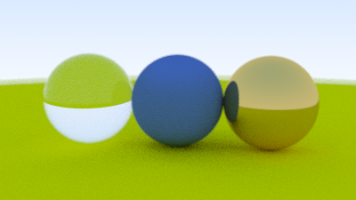

# Raytracer

Raytracer written in Rust to practise the language.
Made using [this](https://raytracing.github.io/books/RayTracingInOneWeekend.html) step-by-step guide.

# How to run:

- Check `src/scenes.rs` and pick or create you own scene.
- Load the correct scene in `src/main.rs`
- Run `make`

# Reference

- https://raytracing.github.io/
